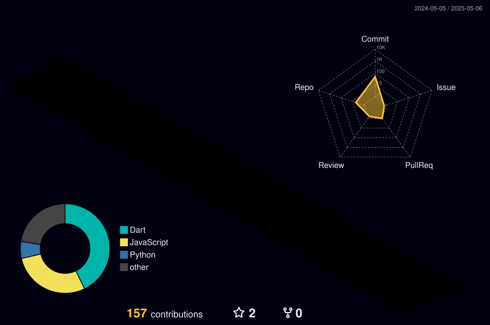

<!-- HEADER BANNER WITH ANIMATED PARTICLES -->

  

<!-- PERSONAL BRAND STATEMENT -->
<h2 align="center">Java | Spring Boot | Microservices | AWS</h2>

  <b>💡 Transforming complex business requirements into elegant, scalable backend solutions.</b>

  
  
  
  

<!-- 3D CONTRIBUTION CALENDAR -->

  

<!-- ABOUT ME WITH ANIMATED GIF -->
<table>
  <tr>
    <td>
      <h2>🚀 About Me</h2>
      

        I'm a <b>Software Engineer</b> specializing in building high-performance backend systems and microservices architecture. With a strong foundation in Java and Spring Boot, I create scalable, production-ready applications that deliver exceptional user experiences.
      

      

        Currently as a <b>Software Engineer Intern at Cognitree</b>, I'm gaining hands-on experience developing distributed systems, optimizing database performance, and implementing security best practices.
      

      

        I'm passionate about clean code, design patterns, and continuous learning. My goal is to build technology that makes a meaningful impact.
      

      <h4>Quick Highlights:</h4>
      <ul>
        <li>🔭 Building <b>microservices-based applications</b> with Spring Boot</li>
        <li>🌱 Advancing my knowledge in <b>system design & cloud architecture</b></li>
        <li>💼 Experienced with <b>AWS, Docker, and CI/CD pipelines</b></li>
        <li>🧠 Solved <b>500+ DSA problems</b> on competitive platforms</li>
        <li>🌟 Proficient in <b>Agile methodologies</b> and team collaboration</li>
        <li>🎓 Completing BTech in CSE from <b>VIT-AP University</b> (2025)</li>
      </ul>
    </td>
    <td width="50%">
      
      <h3 align="center">My Development Philosophy</h3>
      
<i>"First solve the problem, then write the code."</i>

      

        
      

    </td>
  </tr>
</table>

<!-- SKILLS SECTION WITH ANIMATED PROGRESS BARS -->
<h2>🛠️ Technical Expertise</h2>

  
<b>💻 Programming Languages & Frameworks</b>

   
  

    <table>
      <tr>
        <td align="center">
          
           Java
           
          
        </td>
        <td align="center">
          
           Spring Boot
           
          
        </td>
        <td align="center">
          
           Python
           
          
        </td>
        <td align="center">
          
           JavaScript
           
          
        </td>
      </tr>
    </table>
  

  
<b>🗄️ Databases & Cloud Technologies</b>

   
  

    <table>
      <tr>
        <td align="center">
          
           MySQL
           
          
        </td>
        <td align="center">
          
           MongoDB
           
          
        </td>
        <td align="center">
          
           PostgreSQL
           
          
        </td>
        <td align="center">
          
           AWS
           
          
        </td>
      </tr>
    </table>
  

  
<b>🔧 DevOps & Tools</b>

   
  

    <table>
      <tr>
        <td align="center">
          
           Docker
           
          
        </td>
        <td align="center">
          
           Git
           
          
        </td>
        <td align="center">
          
           Kubernetes
           
          
        </td>
        <td align="center">
          
           GitHub Actions
           
          
        </td>
      </tr>
    </table>
  

  
<b>🏗️ Architecture & Concepts</b>

   
  

    
    
    
    
    
    
    
    
  

<!-- GITHUB ANALYTICS -->
<h2>📊 GitHub Analytics</h2>

  
  

  

<!-- ACTIVITY GRAPH -->
<h2>📈 Contribution Activity</h2>

<!-- FEATURED PROJECTS WITH SCREENSHOTS AND DETAILS -->
<h2>🏆 Showcase Projects</h2>

### 🏥 Smart Healthcare Appointment System

<table>
  <tr>
    <td width="60%">
      
      <!-- Replace with actual screenshot URL when available -->
    </td>
    <td width="40%">
      <h3>A full-stack appointment management system</h3>
      
Built with Spring Boot and React to revolutionize healthcare scheduling and patient management. Solves real-world problems for healthcare providers.

      <h4>Key Technologies:</h4>
      

        
        
        
        
        
        
      

      <h4>Core Features:</h4>
      <ul>
        <li>Role-based access for doctors, patients, and staff</li>
        <li>Real-time appointment notifications</li>
        <li>Secure payment processing with Razorpay</li>
        <li>Containerized deployment with load balancing</li>
      </ul>
      
<b>Results:</b> 99.5% uptime, 40% reduction in administrative work, 500+ daily active users

    </td>
  </tr>
</table>

### 🦜 Birdz: Bird Species Classification App

<table>
  <tr>
    <td width="40%">
      <h3>AI-powered bird identification mobile app</h3>
      
A Flutter-based application that uses deep learning to identify Indian bird species in their natural habitats with remarkable accuracy.

      <h4>Technical Stack:</h4>
      

        
        
        
        
        
      

      <h4>Advanced Features:</h4>
      <ul>
        <li>Multi-model AI with ResNet50 and YOLOv8</li>
        <li>Custom dataset of 6,952 bird images</li>
        <li>Responsive UI with image carousels and search</li>
        <li>Serverless backend architecture</li>
      </ul>
      
<b>Achievement:</b> 98% classification accuracy with 99% system uptime

    </td>
    <td width="60%">
      
      <!-- Replace with actual screenshot URL when available -->
    </td>
  </tr>
</table>

<!-- PROFESSIONAL EXPERIENCE WITH TIMELINE -->
<h2>💼 Professional Experience</h2>

  

    

      

        <h3>Software Engineer Intern</h3>
        <h4>Cognitree Pvt Ltd | Mar 2025 - Present</h4>
      

      <ul>
        <li>Developing scalable backend systems using Java and Spring Boot microservices architecture</li>
        <li>Implementing RESTful APIs following best practices and industry standards</li>
        <li>Optimizing SQL queries and database design for improved performance</li>
        <li>Collaborating with cross-functional teams using Agile methodologies</li>
        <li>Contributing to code reviews and maintaining high code quality</li>
      </ul>
      
<b>Tech Stack:</b> Java, Spring Boot, Microservices, PostgreSQL, Docker, AWS

    

  

  

    

      

        <h3>Java Full Stack Developer</h3>
        <h4>iamneo (Formerly Examly) | Aug 2023 - Dec 2023</h4>
      

      <ul>
        <li>Developed full-stack web applications using Java backend and React frontend</li>
        <li>Built RESTful APIs with Spring Boot for data retrieval and manipulation</li>
        <li>Implemented database schemas and optimized queries with MySQL</li>
        <li>Deployed applications using Docker and AWS cloud services</li>
        <li>Gained mentorship and practical experience in real-world projects</li>
      </ul>
      
<b>Tech Stack:</b> Java, Spring Boot, React, MySQL, Docker, AWS

    

  

  

    

      

        <h3>Core Team Member</h3>
        <h4>CodeChef VIT-AP Chapter | Aug 2022 - Apr 2023</h4>
      

      <ul>
        <li>Organized coding competitions, hackathons, and technical workshops for students</li>
        <li>Created and reviewed problem statements for competitive programming events</li>
        <li>Mentored junior members in algorithmic problem-solving techniques</li>
        <li>Contributed to club growth initiatives and campus outreach</li>
      </ul>
      
<b>Skills Gained:</b> Leadership, Event Management, Problem Setting, Technical Communication

    

  

<!-- CERTIFICATIONS AND ACHIEVEMENTS -->
<h2>🏅 Certifications & Achievements</h2>

<table>
  <tr>
    <td>
      
    </td>
    <td>
      
    </td>
  </tr>
</table>

<h4>🏆 Achievements</h4>
<ul>
  <li>🌟 Top 2% in GFG University Leaderboard</li>
  <li>💻 Solved 500+ coding problems on competitive platforms</li>
  <li>🚀 Featured developer in campus showcase</li>
  <li>🏆 Participant in multiple hackathons with successful project completions</li>
</ul>

<!-- WHAT I'M LEARNING NOW -->
<h2>📚 Continuous Learning</h2>

<table>
  <tr>
    <td>
      <h3>Current Focus Areas</h3>
      

        
System Design

        

          

        

        
Kubernetes

        

          

        

        
Cloud-Native Apps

        

          

        

        
Performance Optimization

        

          

        

      

    </td>
    <td>
      <h3>Resources I'm Using</h3>
      <ul>
        <li>📕 System Design Interview by Alex Xu</li>
        <li>🌐 AWS Solutions Architecture certification path</li>
        <li>🎓 Kubernetes for Developers (KFD00) course</li>
        <li>👨‍💻 Contributing to open-source projects</li>
        <li>🧩 Advanced Data Structures & Algorithms practice</li>
      </ul>
      <h4>Learning Philosophy:</h4>
      
<i>"The more I learn, the more I realize how much I don't know."</i>

    </td>
  </tr>
</table>

<!-- LATEST BLOG POSTS (Auto-updated via GitHub Actions) -->
<h2>📝 Latest Technical Articles</h2>

<!-- BLOG-POST-LIST:START -->
<!-- This section will be automatically populated by GitHub Actions workflow -->
<ul>
  <li>💡 <a href="#">Microservices vs Monoliths: When to Choose Which Architecture</a></li>
  <li>🔄 <a href="#">Understanding Spring Boot's Dependency Injection</a></li>
  <li>🚀 <a href="#">Optimizing Docker Containers for Production</a></li>
  <li>🔍 <a href="#">Deep Dive into Java Stream API: Beyond the Basics</a></li>
</ul>
<!-- BLOG-POST-LIST:END -->

  <b><a href="YOUR_BLOG_URL">➡️ More articles</a></b>

<!-- CONNECT WITH ME -->
<h2>📫 Get In Touch</h2>

  
  
  
  
  
  

  
<b>✉️ Open for collaboration and new opportunities!</b>

<!-- FOOTER -->

  
  <h3>✨ "Clean code always looks like it was written by someone who cares." ✨</h3>
  
Thank you for visiting my profile! Let's connect and build something amazing together.

  

<!-- GITHUB ACTION WORKFLOW INSTRUCTIONS (Not visible on GitHub) -->
<!--
To enable auto-updating blog posts, create a GitHub Action workflow:

1. Create a file at .github/workflows/blog-post-workflow.yml with this content:

name: Latest blog posts
on:
  schedule:
    - cron: '0 0 * * *' # Runs every day at midnight
  workflow_dispatch: # Allows manual triggering

jobs:
  update-readme-with-blog:
    name: Update this repo's README with latest blog posts
    runs-on: ubuntu-latest
    steps:
      - uses: actions/checkout@v2
      - uses: gautamkrishnar/blog-post-workflow@master
        with:
          feed_list: "YOUR_BLOG_RSS_FEED_URL"
          max_post_count: 4
          
2. To enable the 3D contribution calendar, setup this workflow at .github/workflows/profile-3d.yml:

name: GitHub-Profile-3D-Contrib

on:
  schedule:
    - cron: "0 18 * * *"
  workflow_dispatch:

jobs:
  build:
    runs-on: ubuntu-latest
    name: generate-github-profile-3d-contrib
    steps:
      - uses: actions/checkout@v2
      - uses: yoshi389111/github-profile-3d-contrib@0.7.0
        env:
          GITHUB_TOKEN: ${{ secrets.GITHUB_TOKEN }}
          USERNAME: ${{ github.repository_owner }}
      - name: Commit & Push
        run: |
          git config user.name github-actions
          git config user.email github-actions@github.com
          git add -A .
          git commit -m "generated"
          git push
-->

